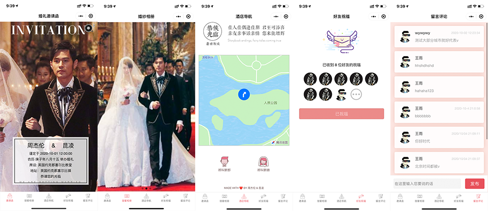
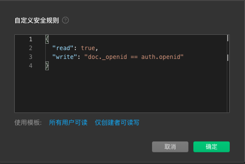

# Wedding-invitation

婚礼邀请函微信小程序，前端+微信云开发，不需要域名和服务器。


## 前提

* 申请一个小程序账号

## 入门

1. clone本项目，并通过微信开发工具导入，导入时填入你的appid

2. 开通云开发(选择免费套餐即可)

3. 新建四个集合，集合名分别是`bless` `photos` `comment` `invitation` `user`

4. 打开`sql`文件夹，按照集合名称导入数据

5. 修改根目录`app.js`文件里面的`env`字段为你的云开发环境id

```javascript
wx.cloud.init({
  env: ''
})
```

6. 右键点击`functions`选择当前云开发环境，在`get_openId`右键选第三项`上传并部署：云端安装依赖`

7. 重新编译

## 数据格式说明

1. `bless`是`好友祝福`页面的数据

1. `comment`数据表是`留言评论`页面的数据

2. `photos`数据表是`甜蜜相册`页面数据

4. `user`表是用户数据

3. `invitation` 数据表(只有一条数据)是基本信息，此数据用于小程序的`首页`和`地图`页面，数据格式如下

```json
{
  // 新郎姓名
  "boy": "周杰伦",
  // 公历结婚日期
  "date": "2020-10-01 12:00:00",
  // 新娘姓名
  "girl": "昆凌",
  // 结婚地点（酒店教堂名称即可）
  "hotel": "英国约克郡塞尔比教堂",
  // 农历结婚日期
  "lunar": "庚子年八月十五",
  // 背景音乐url
  "music": "https://6465-dev-1goaza5i509ecff5-1258198969.tcb.qcloud.la/audio/ido.mp3?sign=f186b54afeca081690c8c03c2573521c&t=1601797034",
  // 背景音乐是否自动播放
  "autoPlay": false,
  // 首页背景大图
  "image": "https://6465-dev-1goaza5i509ecff5-1258198969.tcb.qcloud.la/photos/cover.jpeg?sign=5ebe072ba028b0a2da8aa54fb82586a0&t=1601799069",
  // 结婚地点地址
  "address": "英国约克郡塞尔比镇",
  // 结婚地点经纬度
  "latitude": 38.446324,
  "longitude": 112.735426,
  // 新郎&新娘手机号
  "boyPhone": "13412344321",
  "girlPhone": "13698766789"
}
```

## 注意⚠️⚠️⚠️

* 如遇到小程序页面显示异常，请关闭`ES6转ES5功能`

* 由于[小程序用户头像昵称获取规则调整](https://developers.weixin.qq.com/community/develop/doc/00022c683e8a80b29bed2142b56c01)现在已经不能通过调用`wx.getUserProfile`直接获取用户昵称和头像，所以`Wedding-invitation`按照官方要求修改，用户在首次使用`祝福`和`评论`功能时会跳转到填写用户昵称和头像的页面，引导用户填写内容。

* 需要把云开发的`数据库`所有表 和 `存储` 修改为自定义安全规则。规则如下：



* 如果你是个人小程序`留言评论`页面会**审核不通过**，需要注释掉这个页面😭😭😭


